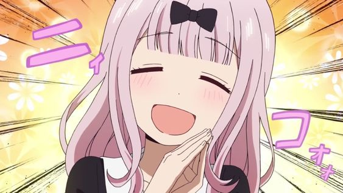

  
  
  "/>
  

    <h1>
    Me chamo Fujiwara Chika, yo! 🎶
     
    Sou uma BOT do Discord, yo! 🎶  
    Criada para animar ser server, yo! 🎶 </h1>

    

 

    <h1>Instruções, yo!  🎶</h1>

-   Crie um arquivo `.env` na raiz do projeto
-   Copie todo conteúdo do arquivo `.env.example` e preeencha os campos (MY_APP_CLIENT_TOKEN é o token do teu BOT)
-   Na raiz do projeto, digite o comando `npm i` ou `yarn` no terminal
-   Rode `npm dev:start` para iniciar o projeto em modo dev.

    <h1>Suporte, yo!  🎶</h1>

-   Meu senpai criou um servidor de suporte no Discord, ele está sempre `on` (assim como eu) para esclarecer qualquer dúvida. Caso queira entrar no servidor de suporte, [clique aqui]("https://discord.gg/uKQqX3p")!

    

