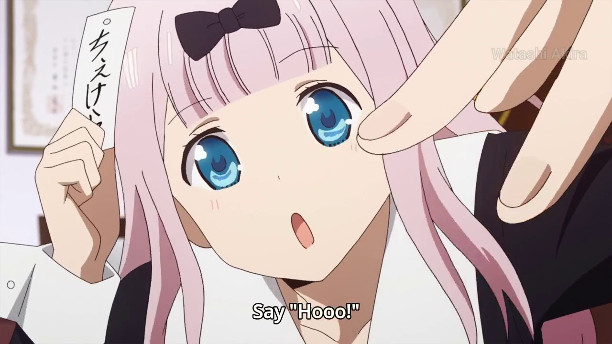

## Me chamo Fujiwara Chika, yo! :notes:

## Sou uma bot do Discord, yo! :notes:

## Criada para animar seu server, yo! :notes:

## INSTRUÇÕES, YO! :notes:

-   Crie um arquivo `.env` na raiz do projeto
-   Copie todo conteúdo do arquivo `.env.example` e preeencha os campos (MY_APP_CLIENT_TOKEN é o token do teu BOT)
-   Na raiz do projeto, digite o comando `npm i` ou `yarn` no terminal
-   Rode `npm dev:start` para iniciar o projeto em modo dev.

